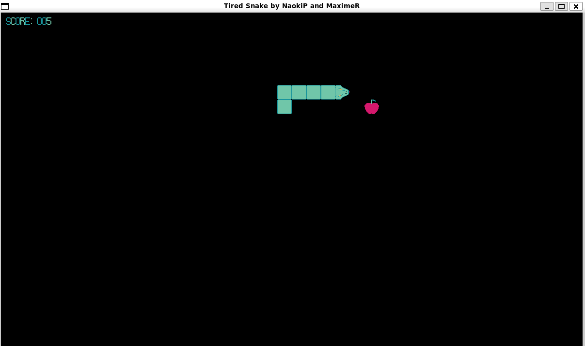

# Snake

My very first programming project, made in high school with **Naoki P.** as a duo project.



## How it works

A classic Snake game built with [Pyxel](https://github.com/kitao/pyxel), a retro game engine for Python.

- Use **arrow keys** to move the snake
- Eat apples to grow longer
- Don't hit the walls or your own tail — or it's game over!

The score (snake length) is displayed in the top-left corner during the game, and on the game over screen.

## Run

```
pip install pyxel
python "Snake NaokiP MaximeR.py"
```
